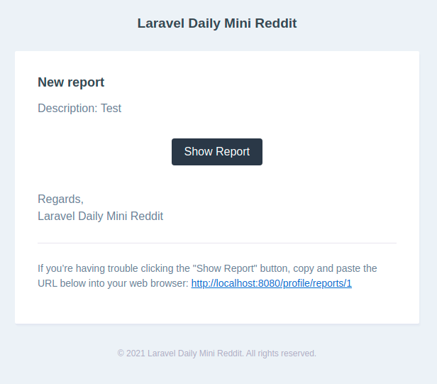

# Администрирование

# Назначение

Назначить администратором можно любого зарегистрированного пользователя с подтвержденной учётной записью.

Нужно выполнить специальную консольную команду с указанием email пользователя, который должен стать администратором:

```
php artisan users:assign-admin-role {email}
```

# Управление сообществами

Адмнистратор может удалять любые сообщества через личный кабинет пользователя:


# Управление публикациями

Администратор может редактировать или удалять любые публикации через публичную часть приложения.

# Управление комментариями

Администратор может редактировать или удалять любые комментарии через публичную часть приложения.

# Управление жалобами

При создании жалобы все администраторы приложения получают почтовые уведомления:



В личном кабинете пользователя администраторам доступна страница управления жалобами на пользовательские материалы:


Здесь можно перейти на страницу просмотра жалобы:


На странице с жалобой есть подробности по объекту жалобы (на что поступила) и суть жалобы (от кого и про что):


Здесь также можно закрыть жалобу:


После этого автор жалобы получит почтовое уведомление о том, что его жалоба закрыта:


