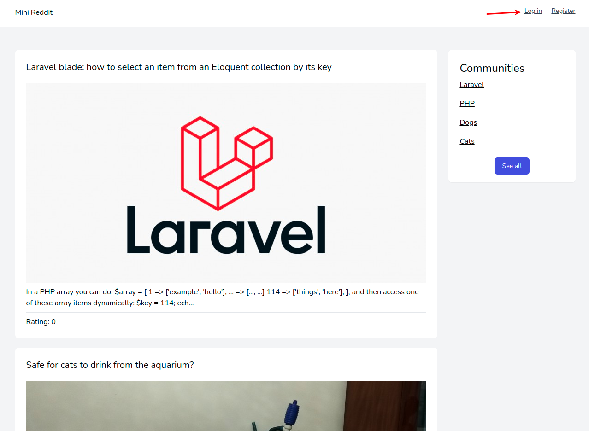
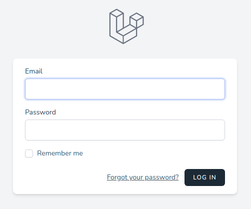
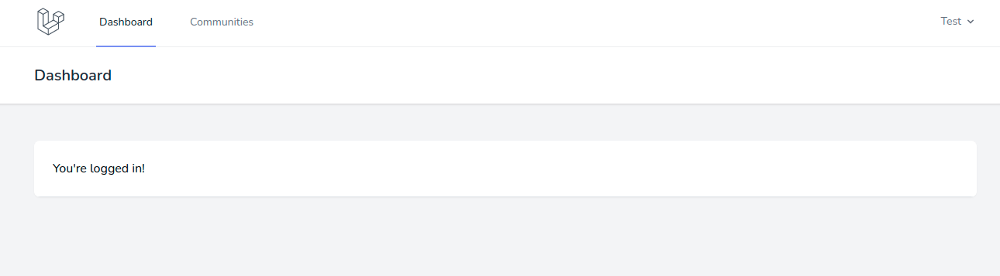

# Аутентификация

Ссылка на аутентификацию (*login*) расположена в шапке приложения:

По клику открывается отдельная страница с формой:

Если учетная запись была подтверждена ранее, то после успешной аутентификации происходит переадресация на главную страницу личного кабинета пользователя:

---

Следующее: [Сброс пароля](../forgot/README.md)
