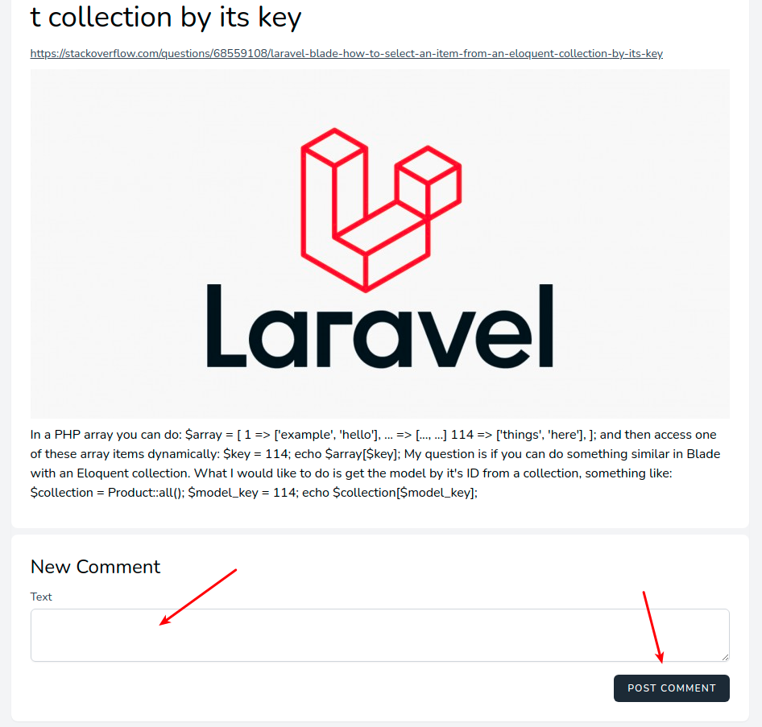
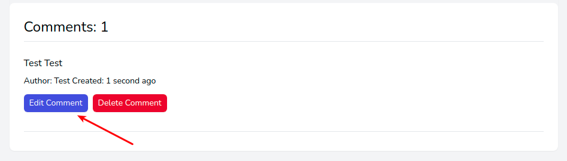
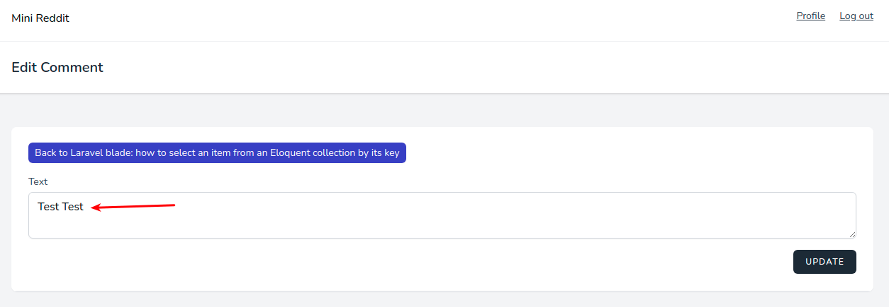
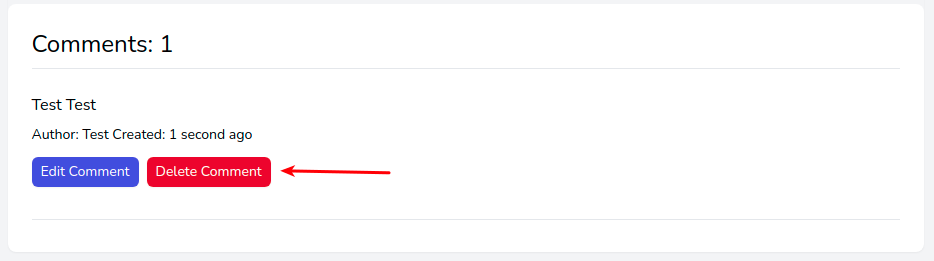
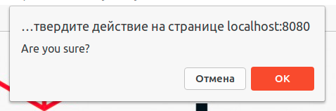

# Управление комментариями

## Добавление

На странице любой публикации можно добавить для неё комментарий:

## Редактирование

В блоке с добавленным ранее комментарием есть кнопка редактирования:

На странице с формой можно ввести новый текст для комментария:

## Удаление

В блоке с добавленным ранее комментарием есть кнопка удаления:

После подтверждения комментарий будет удален:

---

Следующее: [Управление рейтингом публикаций](../votes/README.md)
