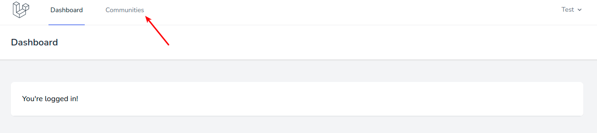
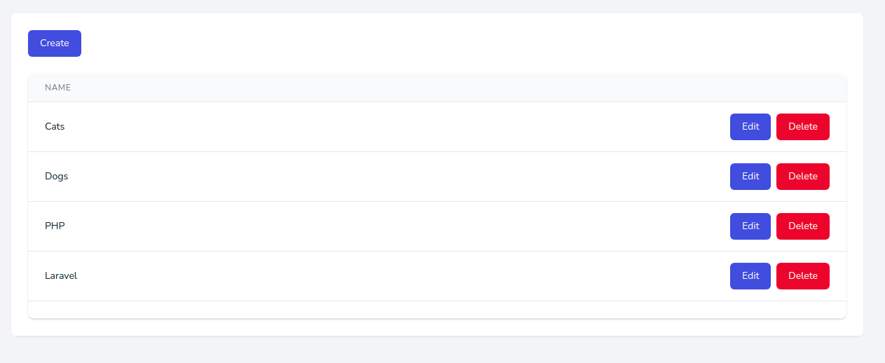
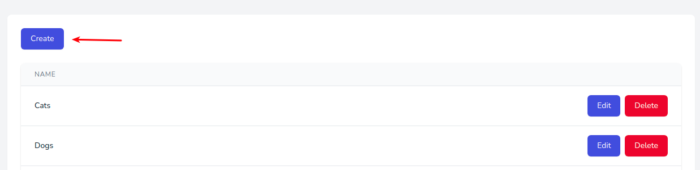
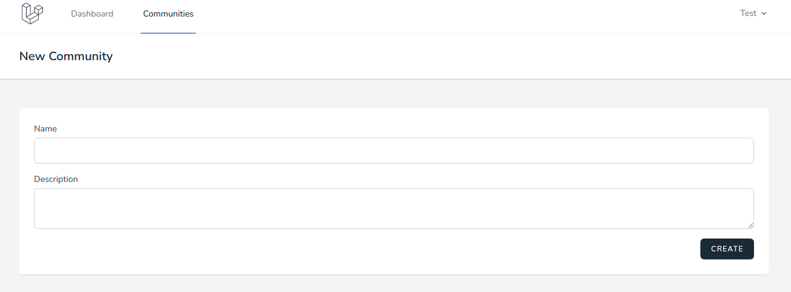
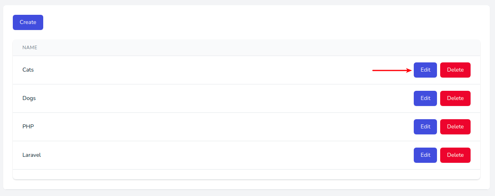
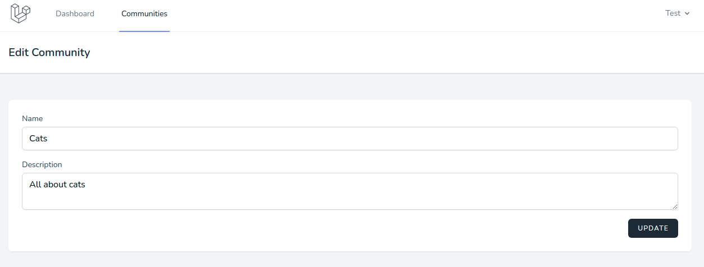
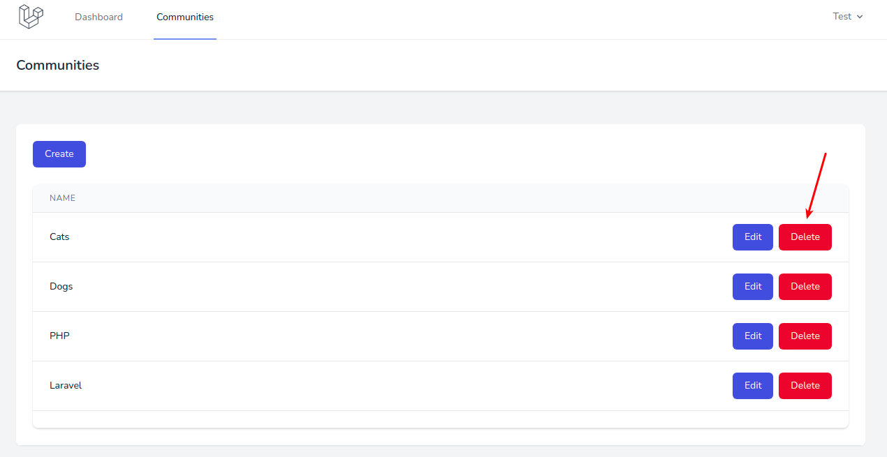
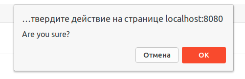

# Управление сообществами

После аутентификации в личном кабинете необходимо перейти на страницу управления сообществами:

Здесь отображается список собственных созданных сообществ:

## Создание

Кнопка **Create** позволяет создать новое сообщество:

Она открывает страницу с формой:

* **Name** - название сообщества, должно быть уникальным
* **Description** - описание сообщества, должно быть не больше 500 символов

## Редактирование

Любое созданное ранее сообщество можно отредактировать в списке всех сообществ:

По кнопке откроется новая страница, где можно отредактировать текущие данные сообщества:

## Удаление

Любое созданное ранее сообщество можно удалить в списке всех сообществ:

После подтверждения сообщество будет удалено:

---

Следующее: [Управление публикациями](../posts/README.md)

