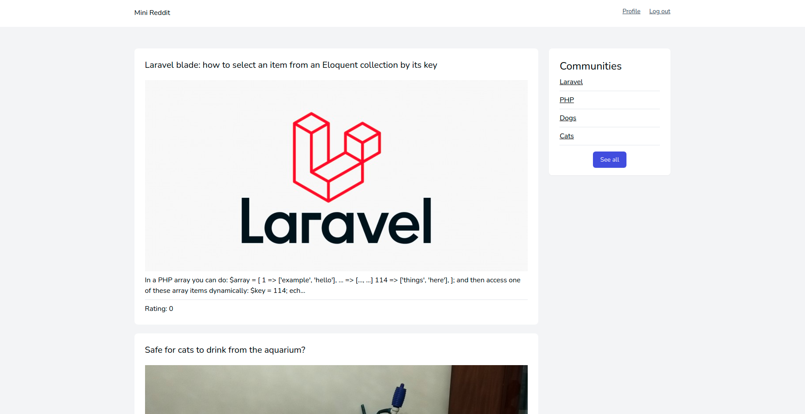

# Введение

Приложение **Laravel Daily - Mini Reddit** повторяет идеи сервиса [reddit](https://reddit.com).

Зарегистрированные пользователи могут создавать сообщества по интересам (объединенные какой-то общей темой, которая в дальнейшем будет обсуждаться пользователями данного сообщества), добавлять туда публикации и оставлять к ним комментарии.

Приложение создано в рамках курса [Creating mini-Reddit in Laravel 8](https://laraveldaily.teachable.com/p/creating-mini-reddit-in-laravel-8).

---

Следующее: [Установка](../setup/README.md)
