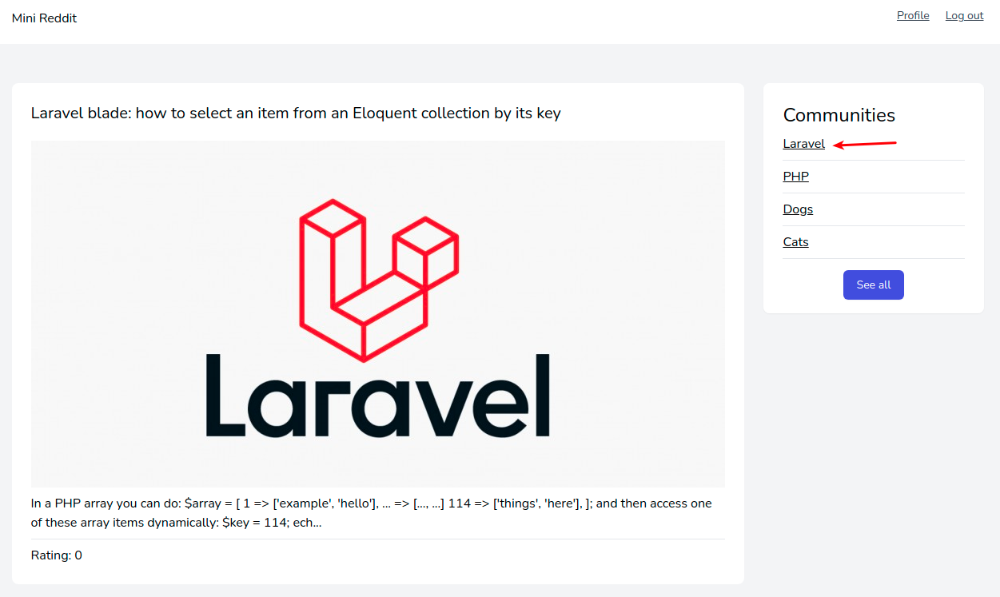
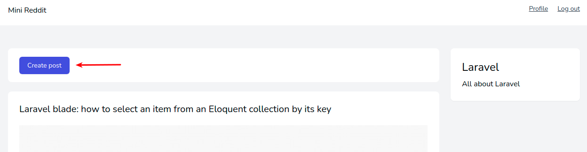
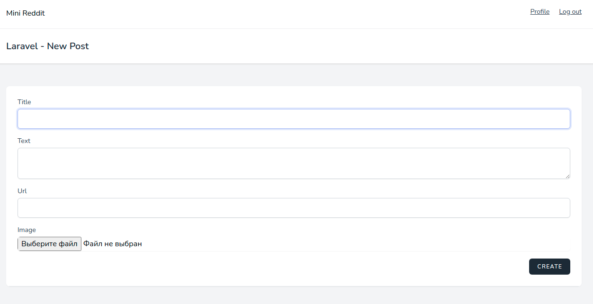
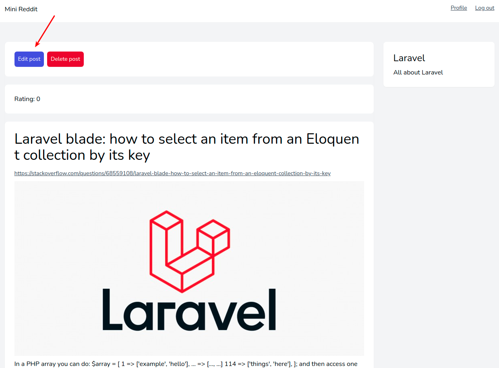
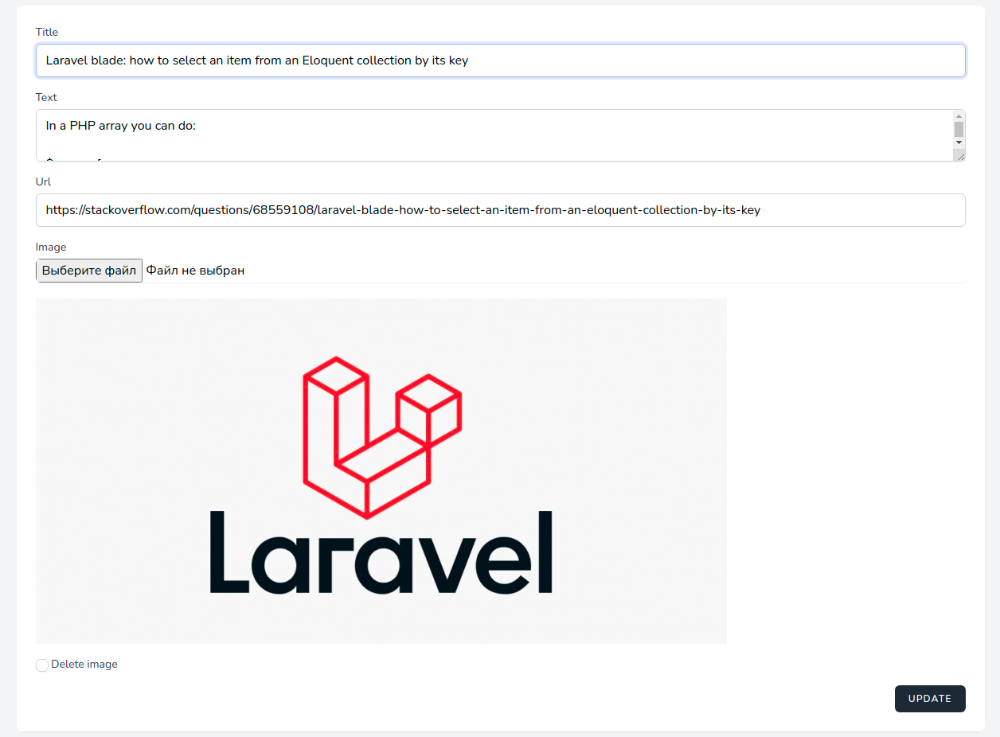
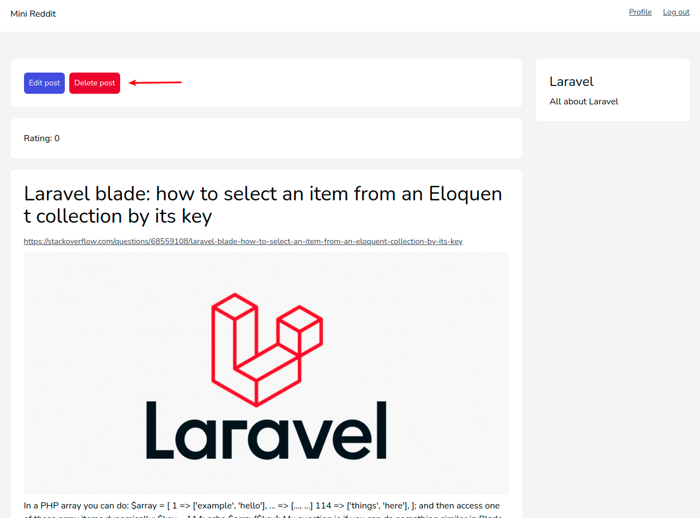
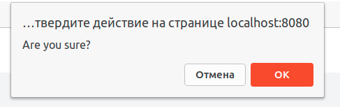

# Управление публикациями

## Создание

Для создания публикаций необходимо перейти на страницу любого сообщества:

И нажать кнопку **Create post**:

Откроется новая страница с формой:

* **Title** - заголовок публикации
* **Text** - содержимое публикации, её текст
* **Url** - ссылка публикации, которая каким-то образом связана с публикацией
* **Image** - изображение, которое станет обложкой публикации

## Редактирование

На странице просмотра публикации можно перейти на страницу её редактирования:

Здесь находится форма с уже заполненными данными по публикации:

Сохранение с включенным чекбоксом **Delete image** удалит текущую обложку публикации.

## Удаление

На странице просмотра публикации можно удалить эту публикацию:

После подтверждения публикация будет удалена:

---

Следующее: [Управление комментариями](../comments/README.md)
