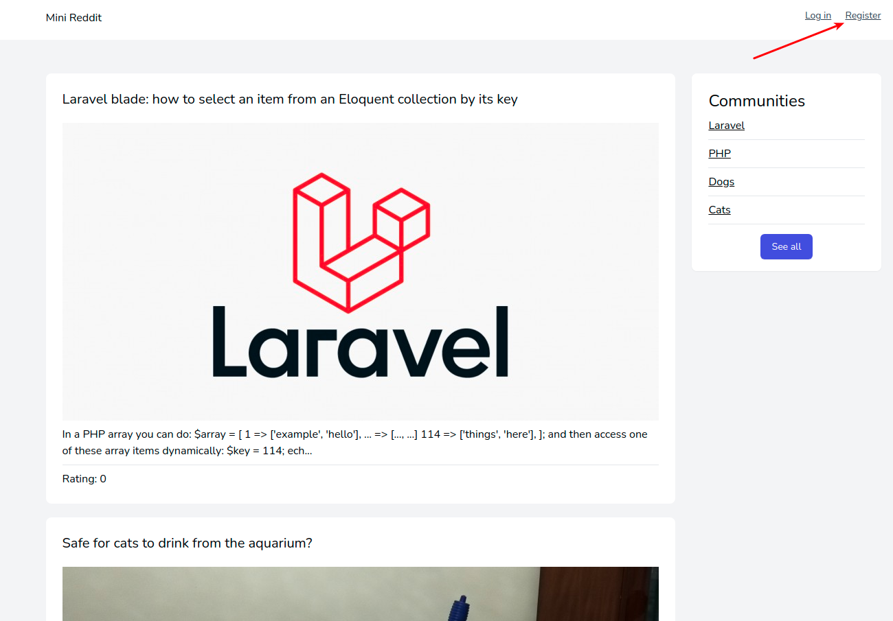
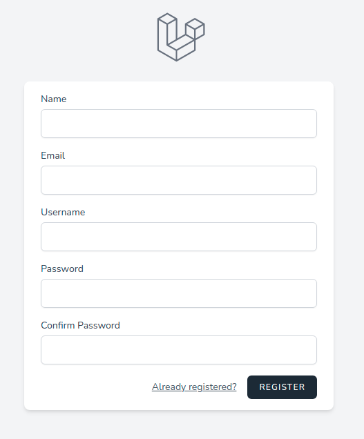
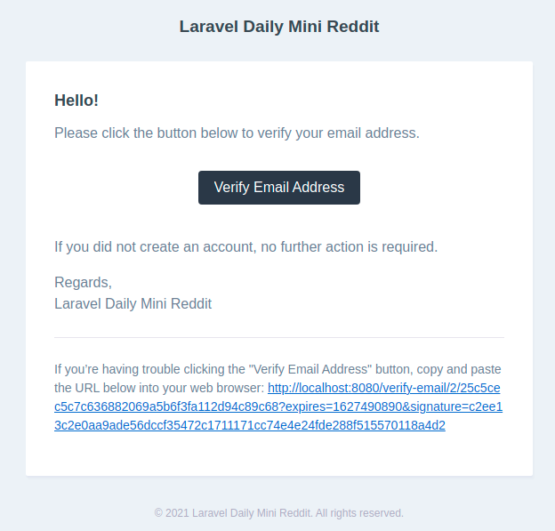
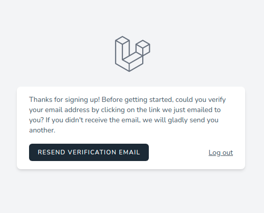
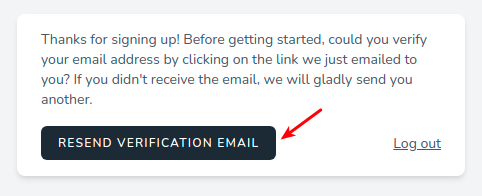

# Регистрация

Ссылка на регистрацию расположена в шапке приложения:

По клику открывается отдельная страница с формой:

* **Name** - произвольное имя пользователя
* **Email** - email пользователя, должен быть уникальным
* **Username** - никнейм пользователя, может содержать буквы и цифры, должен быть уникальным
* **Password** - пароль пользователя, длина не менее 8 символов
* **Confirm Password** - подтверждение пароля пользователя, должно быть равно значению в предыдущем поле

Все поля обязательны для заполнения.

После завершения процесса регистрации пользователь будет аутентифицирован, но должен будет **подтвердить** свою учётную запись.

На указанный ранее email придёт письмо с ссылкой для подтверждения учетной записи:

Без подтверждения учетной записи пользователь не сможет использовать приложение и будет переадресован на информационную страницу:

Здесь также можно запросить повторную отправку письма для подтверждения:

---

Следующее: [Аутентификация](../auth/README.md)
