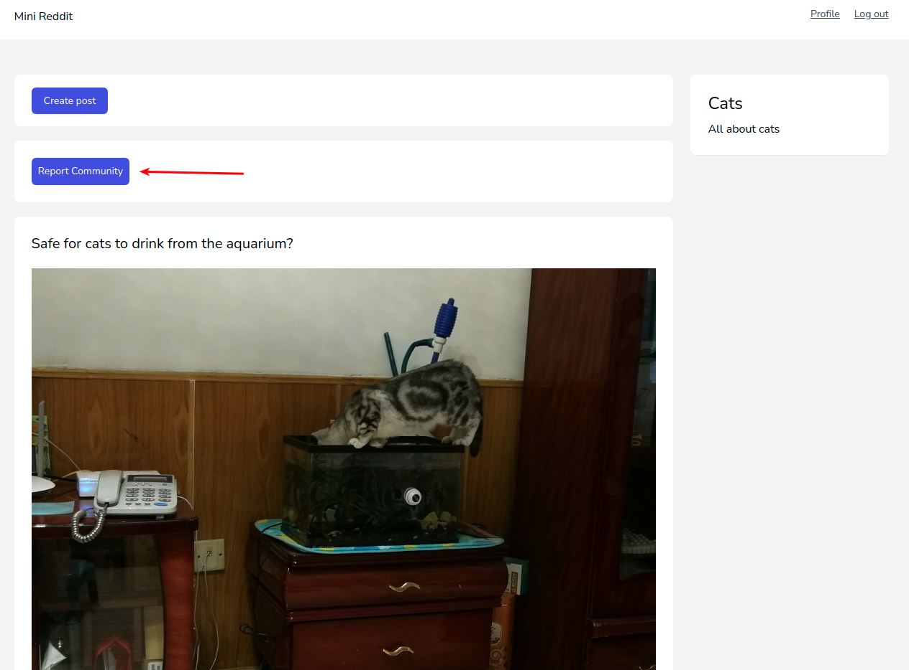
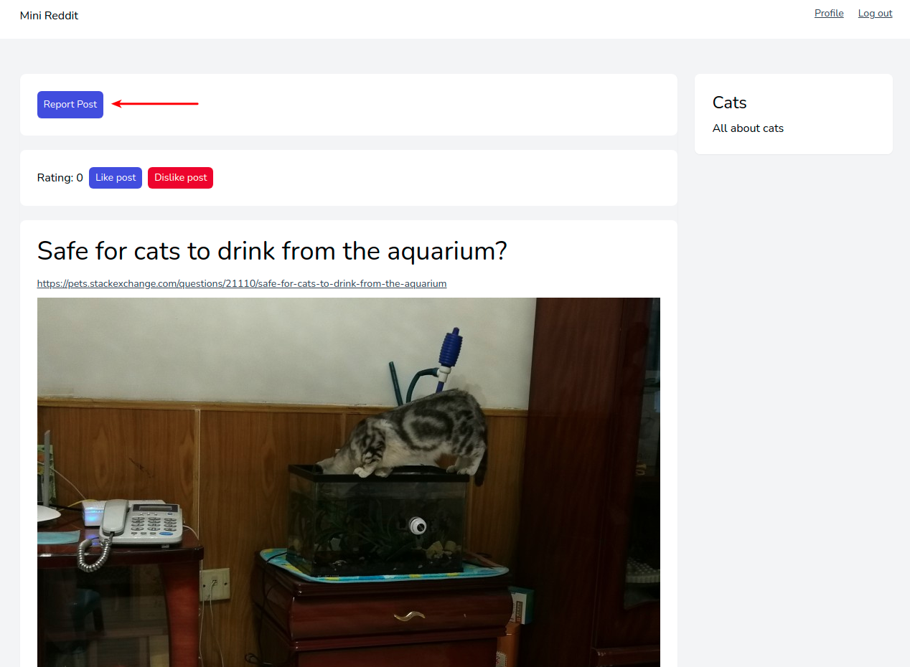
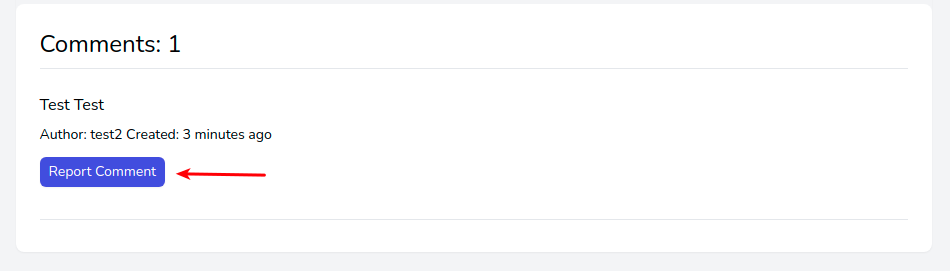
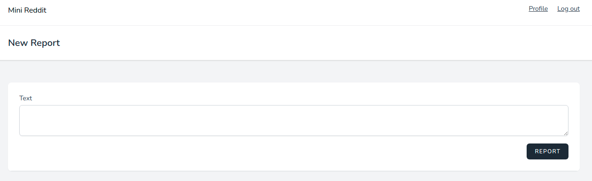

# Жалобы на материалы

Пользователи могут жаловаться на материалы других пользователей.

На сообщества:

На публикации:

На комментарии:

При нажатии на кнопку открывается новая страница с формой:

Здесь можно описать причину и отправить жалобу администраторам приложения.

---

Следующее: [Администрирование](../admin/README.md)
