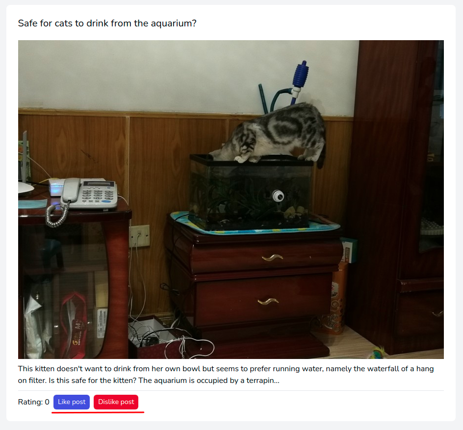
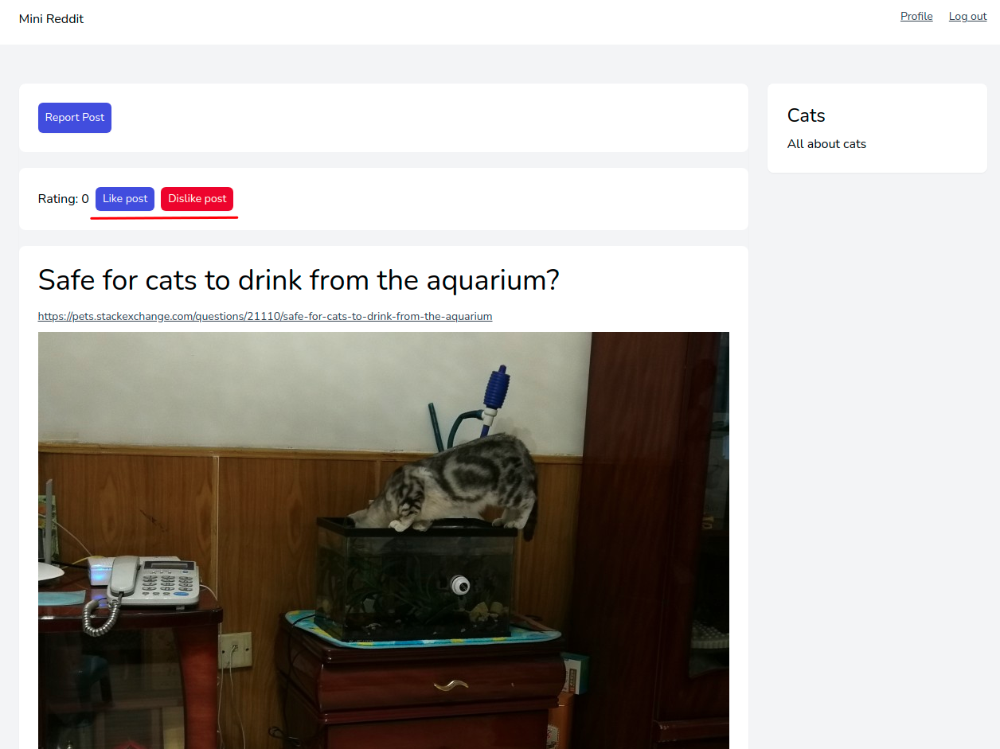

# Управление рейтингом публикаций

Любой аутентифицированный пользователь может оценивать публикации других пользователей.

Кнопки **"Like post"** / **"Dislike post"** находятся под публикациями в общей ленте публикаций:

И на странице просмотра публикации:

Там же находится общее значение рейтинга публикации.

Кнопка **Like post** увеличивает значение рейтинга
Кнопка **Dislike post** уменьшает значение рейтинга

---

Следующее: [Жалобы на материалы](../reports/README.md)
